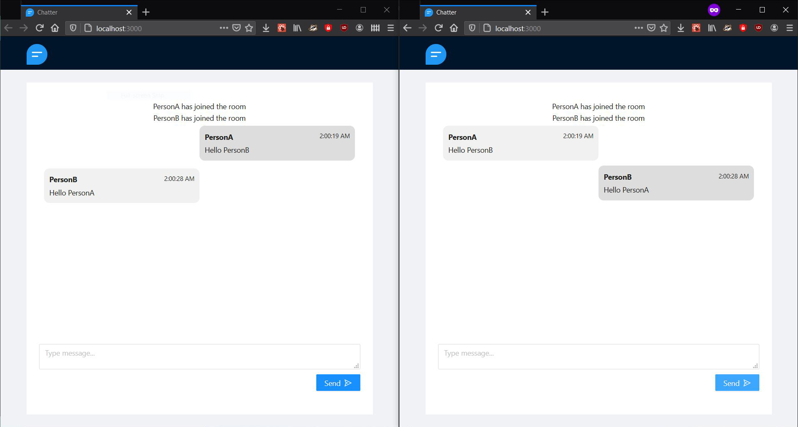

# Chatter

A real time messaging proof of concept using SocketIO.

## To Run

### Client Side

```sh
cd client
npm install

npm run start
```

### Server Side

```sh
cd server
npm install

npm run start # Uses nodemon
```

## Screenshots

1. Set username


2. Typing Indicator (1 person)


3. Typing Indicator (2 persons)


4. Typing Indicator (3 persons)


5. Chat


6. User Left Chat


---

Icons made by [Pixel Perfect](https://icons54.com) from [Flaticon](https://www.flaticon.com)